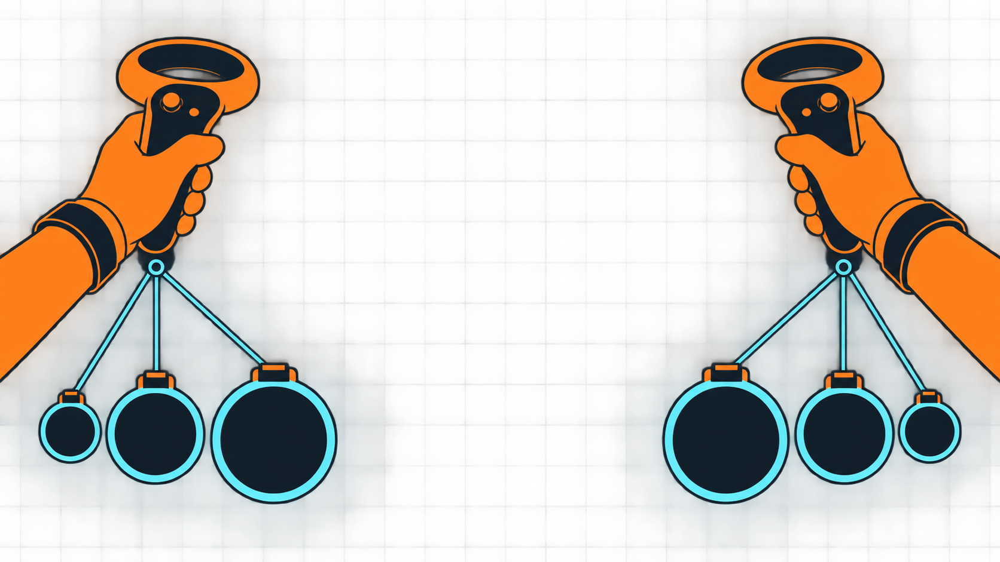

# Hand Quickbelts

Hand Quickbelts is a code-only BepInEx mod for H3VR. It adds configurable quickbelt slots below the player's left and right hands while preserving the selected vanilla quickbelt layout.



## Configuration

The generated BepInEx config exposes these values, each constrained to `0-10`:

- `Left Hand / Large Slots`
- `Left Hand / Medium Slots`
- `Left Hand / Small Slots`
- `Right Hand / Large Slots`
- `Right Hand / Medium Slots`
- `Right Hand / Small Slots`

Live layout controls:

- `Anchor / Position (meters)` and `Rotation (degrees)` shared vectors
- `Layout / Columns`, `Column Spacing (mm)`, and `Row Spacing (mm)`
- `Layout / Slot Diameter (mm)` (native sphere visuals and coincident spherical hit-test volume)
- `Stored Objects / Miniaturize Stored Objects` and `Target Size (mm)`
- `Live Adjustment / Enable Adjustment Handles`
- `Live Adjustment / Reset All Settings`

The default is one large slot on each hand. Configuration changes are applied at runtime; items in hand-attached slots are dropped when those slots are rebuilt.

Position, rotation, spacing, column count, and slot diameter changes apply live without rebuilding slots or dropping their contents. Layout values have no configured maximum. Every slot owns a hand-attached `QuickbeltRoot`, `HoverGeo`, and `PoseOverride`; no runtime reference is retained from the inactive vanilla configuration used as its template. The visible base and state highlight are clones of H3VR's native sphere renderers and materials. `HoverGeo` is the coincident spherical interaction volume, and H3VR controls the normal hover, spawnlock, and hardened colors. In a profile with Sodalite installed, use the wrist menu's Mod Panel to edit the Hand Quickbelts settings while looking at your forearms. Changing the number of slots still requires a rebuild and drops items held by those slots.

For HQB slots, insertion hover uses the held object's enabled physical collider bounds against the exact visible sphere. This replaces H3VR's native single-`PoseOverride`-point test for these slots only, so touching the visible 20 cm volume with the item produces the hover. Empty-hand retrieval and all non-HQB slots retain the native game behavior.

Stored-object miniaturization is enabled by default. Like SpineHero, HQB measures the combined collider bounds and uniformly scales an object down only when it exceeds the configured target size (80 mm by default, sized for the 100 mm slot). The original scale is restored before H3VR reparents or removes the object from the slot. Disable the option to retain normal-sized stored objects.

The shared default palm-local anchor position is `(-1.7515284, -0.57437253, -0.59017724)` meters with Euler rotation `(-62.12213, -120.375916, -44.089874)` degrees. Position and rotation can be typed as `x, y, z` in the Mod Panel, but adjustment handles are the primary editing method and preserve the full released pose. The config stores the canonical right-hand pose. The left-hand position and quaternion are reflected across the local X plane; releasing the left handle performs the inverse reflection before saving.

For direct manipulation, enable `Live Adjustment / Enable Adjustment Handles` in the in-game Mod Panel. A yellow handle appears on the left anchor and a cyan handle on the right. Grab a handle with the opposite hand, move/rotate it, and release; the resulting palm-local pose is immediately written to the hand position config and saved. Toggle `Reset All Settings` to restore every setting to its default; the toggle switches itself back off.

Slot size uses H3VR's native `FVRPhysicalObjectSize` limit, so the game remains responsible for deciding which items fit.

Development diagnostics are intentionally absent from the user config. Set `DeveloperDiagnosticsEnabled` in `Plugin.cs` to `true` and rebuild to log runtime ownership, transforms, scales, native renderer state, and hover transitions. See [the quickbelt research note](docs/quickbelt-research.md) for the extracted vanilla and SpineHero hierarchies and decompiled game-code path.

## Building

Requirements: the .NET SDK and NuGet access.

```powershell
dotnet build .\HQB.sln -c Release
```

The plugin is written to `plugin/bin/Release/net35/quaternion.hqb.dll`. Install it in the H3VR profile's `BepInEx/plugins` directory.

## Reference

The requested behavior was inspired by Ax's [SpineHero](https://thunderstore.io/c/h3vr/p/Ax/SpineHero/). SpineHero's Thunderstore package exposes decompilable assemblies but does not link a public source repository. This project ports its slot hierarchy and collider-bounds scaling approach while creating slots from vanilla H3VR quickbelt prefabs, so it does not require OtherLoader or a MeatKit asset bundle.
